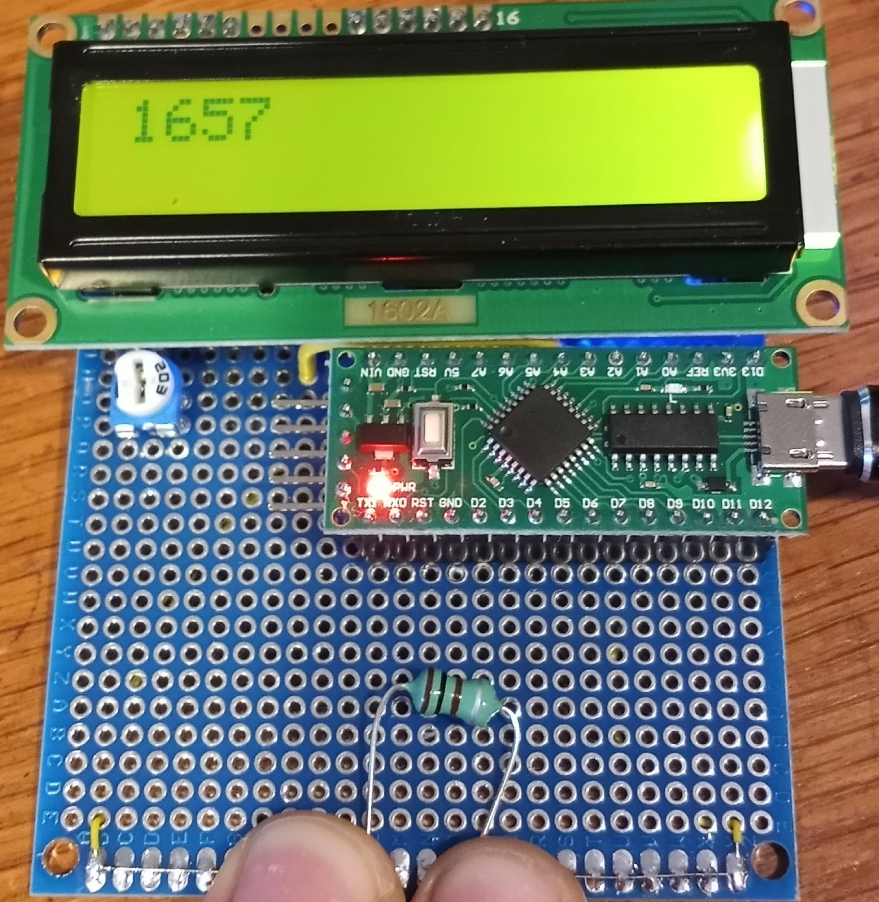
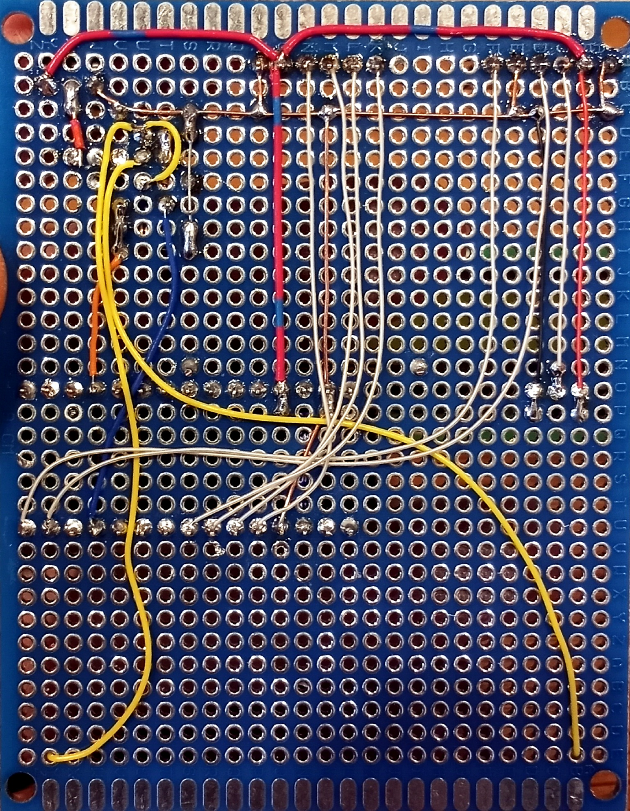

# LMeter
Simple Arduino nano based inductor tester

After measuring inductors with a function generator, an oscilloscope and a calculator, I decided that I needed a quicker way to measure inductor values, from ~1uH to ~100uH (or from 1uH to as high as I can manage).

I stumbled upon this project (https://skootsone.yolasite.com/l-meter.php), which inspired me to actually cobble something quick and dirty and 'good enough' together. I don't have any mechanical meter movements around, and realized that buying one plus a cheap solar light to scavange from would cost more than using a  and character LCD. And, I already have those in my parts bin.

The concept is simple enough - apply a square wave (I settled on 200kHz) to an inductor, and build a crude boost converter. Then measure the voltage drop produced across a load. The rest is all details, which I crudely banged together mostly by guess-and-test, with the skootsone design values as my starting point. I picked the blue LED/1k resistor as a load after playing around to find something that produces a voltage response that most closely fits within my ADC's range. I powered the boost converter from a 1.2V source, to keep the maximum voltage produced down, and to ensure that I have a fairly stable reference voltage for testing. I settled on a 33uH inductor, which also limits the maximum voltage output (though, a 22 or 27uH might be a better fit). I cobbled things up on a solderless breadboard, and fiddled around with component values until I produced something which worked okay. I may make some further changes to component values in order to get a response curve that provides the best resolution over the range of inductors that I plan to test. I may also implement some DC signal conditioning with an opamp to make bestuse of my ADC's range (and not waste bits measuring values I'm not interested in)

Using a microcontroller (as opposed to a mechanical movement) does give me a bit of additional flexability to potentially extend functionality down the road. For example, I've seen some methods for measuring saturation current, which I might eventually implement here.

The end result of all of this is a circuit which produces an output of roughly 0V (infine inductance / open circuit) to 3.6V (zero inductance / short circuit), which is sampled by the ADC. Right now, I'm just spitting that raw value out to the LCD. Next, I need to measure out a bunch of different inductor values, and plot out a response curve. Hopefully, I can approximate a function that describes the curve - then I'll have the uC do some math, and spit out a result in uH. Otherwise, I'll build a mapping table to use.
